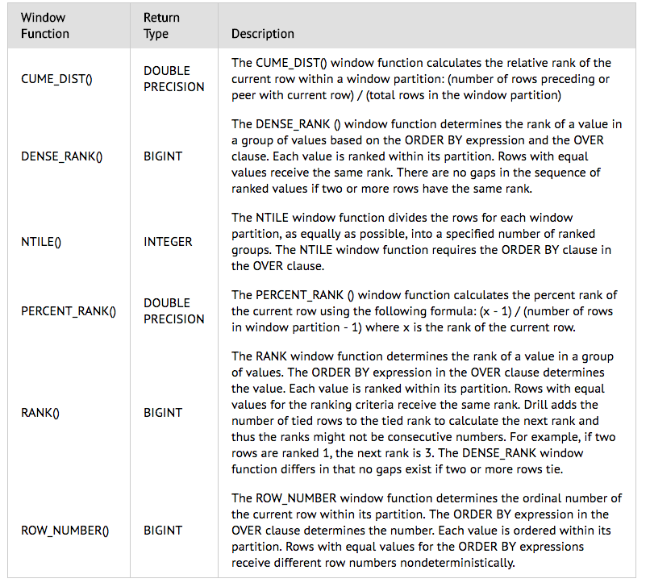

#Prepare for SQL interview

## Basic
* General: where / group by / order by / left join / [right join](http://www.w3schools.com/sql/sql_join_right.asp) / inner join / null / not null /[insert](http://www.w3schools.com/sql/sql_insert.asp)/ [having](http://www.w3schools.com/sql/sql_having.asp) / distinct / [like](http://www.w3schools.com/sql/sql_like.asp) / [union](http://www.w3schools.com/sql/sql_union.asp) / avg / sum / min / max / [substring](https://dev.mysql.com/doc/refman/5.7/en/string-functions.html#function_substr) / [REGEXP(RLIKE)](https://dev.mysql.com/doc/refman/5.7/en/regexp.html#operator_regexp) / [limit+top](https://www.w3schools.com/sql/sql_top.asp) / CONCAT

* [Arithmetic](http://www.w3resource.com/sql/arithmetic-functions/sql-arithmetic-function.php):  ROUND / POWER / ABS / concat / CEIL / FLOOR / LN / MOD = % / SQRT / EXP

<br>
<br>


##  [Window functions](https://drill.apache.org/docs/sql-window-functions-introduction/)
* Syntax
  
  ```
  window_function (expression) OVER (
   [ PARTITION BY expr_list ]
   [ ORDER BY order_list ][ frame_clause ] )  
  ```   
* Value: [FIRST_VALUE()](https://docs.oracle.com/cd/B28359_01/server.111/b28286/functions059.htm)/LAG()/LAST_VALUE()/[LEAD()](https://docs.oracle.com/cd/B19306_01/server.102/b14200/functions074.htm)
* Aggregate: AVG()/COUNT()/MAX()/MIN()/SUM()
* Ranking: CUME_DIST()/DENSE_RANK()/[NTILE()](https://docs.oracle.com/cd/B19306_01/server.102/b14200/functions101.htm)/PERCENT_RANK()/[RANK()](https://docs.oracle.com/cd/B19306_01/server.102/b14200/functions123.htm)/ROW_NUMBER()

* Special: unbound PROCEEDING and unbound FOLLOWING, RANGE ([details+visual](https://databricks.com/blog/2015/07/15/introducing-window-functions-in-spark-sql.html) )

>There are five types of boundaries, which are UNBOUNDED PRECEDING, UNBOUNDED FOLLOWING, CURRENT ROW, <value> PRECEDING, and <value> FOLLOWING. UNBOUNDED PRECEDING and UNBOUNDED FOLLOWING represent the first row of the partition and the last row of the partition, respectively. For the other three types of boundaries, they specify the offset from the position of the current input row and their specific meanings are defined based on the type of the frame. There are two types of frames, ROW frame and RANGE frame.

## SQL windows function examples ([ref]())
* Aggregation function as window function
```
SELECT start_terminal,
       duration_seconds,
       SUM(duration_seconds) OVER
         (PARTITION BY start_terminal ORDER BY start_time)
         AS running_total
  FROM tutorial.dc_bikeshare_q1_2012
 WHERE start_time < '2012-01-08'
```
* LAG()/LEAD() as window function
```
SELECT *
  FROM (
    SELECT start_terminal,
           duration_seconds,
           duration_seconds -LAG(duration_seconds, 1) OVER
             (PARTITION BY start_terminal ORDER BY duration_seconds)
             AS difference
      FROM tutorial.dc_bikeshare_q1_2012
     WHERE start_time < '2012-01-08'
     ORDER BY start_terminal, duration_seconds
       ) sub
 WHERE sub.difference IS NOT NULL
```
LAG() pulls from previous rows and LEAD() pulls from following rows. 

* ROW_NUMBER()/RANK() as window function
```
SELECT start_terminal,
       start_time,
       duration_seconds,
       ROW_NUMBER() OVER (PARTITION BY start_terminal
                          ORDER BY start_time)
                    AS row_number
  FROM tutorial.dc_bikeshare_q1_2012
 WHERE start_time < '2012-01-08'
 ```
 RANK() is slightly different from ROW_NUMBER(). If you order by start_time, for example, it might be the case that some terminals have rides with two identical start times. In this case, they are given the same rank, whereas ROW_NUMBER() gives them different numbers. You can use `NTILE(*# of buckets*)`, for example, NTILE(100), to identify what percentile a given row falls into. 

* Bounded and Unbounded **ROWS** ([ref](http://stevestedman.com/2013/04/rows-and-range-preceding-and-following/))
  * Bounded
  ```
  --ROWS PRECEDING AND FOLLOWING
  SELECT Year, DepartmentID, Revenue,
  sum(Revenue) OVER (PARTITION by DepartmentID
  ORDER BY [YEAR]
  ROWS BETWEEN 1 PRECEDING AND 1 FOLLOWING) as BeforeAndAfter
  FROM REVENUE
  ORDER BY departmentID, year;
  ```
  * Unbounded
  ```
  -- ROWS UNBOUNDED FOLLOWING
  -- http://stevestedman.com/?p=1485
  SELECT Year, DepartmentID, Revenue,
  min(Revenue) OVER (PARTITION by DepartmentID
  ORDER BY [YEAR]
  ROWS BETWEEN CURRENT ROW AND UNBOUNDED FOLLOWING) as MinRevenueBeyond
  FROM REVENUE
  ORDER BY departmentID, year;
  ```

* Create window function alias
If you’re planning to write several window functions in to the same query, using the same window, you can create an alias. 
```
SELECT start_terminal,
       duration_seconds,
       NTILE(4) OVER
         (PARTITION BY start_terminal ORDER BY duration_seconds)
         AS quartile,
       NTILE(5) OVER
         (PARTITION BY start_terminal ORDER BY duration_seconds)
         AS quintile,
       NTILE(100) OVER
         (PARTITION BY start_terminal ORDER BY duration_seconds)
         AS percentile
  FROM tutorial.dc_bikeshare_q1_2012
 WHERE start_time < '2012-01-08'
 ORDER BY start_terminal, duration_seconds
```
can be rewritten as
```
SELECT start_terminal,
       duration_seconds,
       NTILE(4) OVER ntile_window AS quartile,
       NTILE(5) OVER ntile_window AS quintile,
       NTILE(100) OVER ntile_window AS percentile
  FROM tutorial.dc_bikeshare_q1_2012
 WHERE start_time < '2012-01-08'
WINDOW ntile_window AS
         (PARTITION BY start_terminal ORDER BY duration_seconds)
 ORDER BY start_terminal, duration_seconds
 ```


## Other SQL related tools
* [Spark2.0 SQL guide](https://spark.apache.org/docs/2.0.0-preview/sql-programming-guide.html)
* [window functions in Spark](https://databricks.com/blog/2015/07/15/introducing-window-functions-in-spark-sql.html)
* SQL optimization: [link1](http://www.teradata-sql.com/2012/03/sql-optimization.html), [link2](http://www.teradatahelp.com/2010/11/teradata-performance-tuning-basic-tips.html)

## Possible questions
(1)Q: what is the difference between WHERE and HAVING
* A: [HAVING is used to check conditions after the aggregation takes place.](http://stackoverflow.com/questions/287474/whats-the-difference-between-having-and-where)

(2)Q: what is the difference between GROUP BY and ORDER BY
* A: ORDER BY allows you to sort the result set according to different criteria, such as first sort by name from a-z, then sort by the price highest to lowest. GROUP BY will aggregate records by the specified columns which allows you to perform aggregation functions on non-grouped columns (such as SUM, COUNT, AVG, etc). ORDER BY can be used within the over() clause

(3)Q: how to create a view
* A: The basic CREATE VIEW syntax is as follows: CREATE VIEW view_name AS SELECT column1, column2..... FROM table_name WHERE [condition]; You can include multiple tables in your SELECT statement in very similar way as you use them in normal SQL SELECT query. In SQL, a view is a virtual table based on the result-set of an SQL statement. A view contains rows and columns, just like a real table. The fields in a view are fields from one or more real tables in the database.

(4)Q: What is the difference between aggregation function used together with `group by` and aggregation function used as `window function`? 
* A: A window function performs a calculation across a set of table rows that are somehow related to the current row. This is comparable to the type of calculation that can be done with an aggregate function. But unlike regular aggregate functions, use of a window function does not cause rows to become grouped into a single output row — the rows retain their separate identities. Behind the scenes, the window function is able to access more than just the current row of the query result. You can’t use window functions and standard aggregations in the same query. More specifically, you can’t include window functions in a `GROUP BY` clause.

(5)Q: What is the difference between `ROWS` and `RANGE` ([ref](https://databricks.com/blog/2015/07/15/introducing-window-functions-in-spark-sql.html))
* A: ROWS means the specific row or rows specified, and RANGE refers to those same rows plus any others that have the same matching values.ROW frames are based on **physical** offsets from the position of the current input row, which means that CURRENT ROW, <value> PRECEDING, or <value> FOLLOWING specifies a physical offset. RANGE frames are based on **logical** offsets from the position of the current input row, and have similar syntax to the ROW frame. A logical offset is the difference between the value of the ordering expression of the current input row and the value of that same expression of the boundary row of the frame. 
